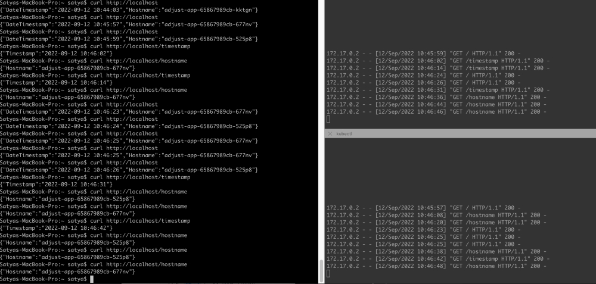

# adjust

## Author: Satya 09-12-2022

## Prerequisites
- Docker
- Python
- minikube
- git

## Basic Components of the Application: 

- Dockerfile: Configuration file that instructs the runtime how to build your container
- requirements.txt: A list of python dependencies needed to run our code.
- app.py: Python script to respond to HTTP requests to the container

## Dockerfile Descriptoin: 

- The python:3-alpine image is used as a base. The alpine image is used as it is small and lightweight.
- The WORKDIR is set to /usr/src/adjust
- The contents of the build context (the current dir which contains the Dockerfile) are copied to the WORKDIR in the container
- pip install is executed against the requirements file, installing our dependencies.

## To build and run the docker container:

First, let's run our docker image locally to determine if it works as we expect.

```sh
cd adjust
docker build -t adjust_app .
docker run -p 5000:5000 -d adjust_app:latest
```

## minikube installation and start

```sh
curl -LO https://storage.googleapis.com/minikube/releases/latest/minikube-darwin-amd64
sudo install minikube-darwin-amd64 /usr/local/bin/minikube

minikube start
minikube status
    minikube
    type: Control Plane
    host: Running
    kubelet: Running
    apiserver: Running
    kubeconfig: Configured
```

In order for the Ingress controller to work, the cluster must have an Ingress controller running

Minikube v1.6.2 (and above) ships with Nginx ingress setup as an add-on (as requested here). It can be easily enabled by executing.
```sh
minikube addons enable ingress
```
For minikube we need to push our local image to minikube images
```sh
minikube image load adjust_app:latest
```

## Apply the k8s deployment, service and ingress services

Applying deployment/services/ingress in 'default' namespace

```sh
kubectl apply -f deployment.yml
kubectl apply -f service.yml
kubectl apply -f ingress.yml
```

Check pods, service and ingress

```sh

To check pods:

kubectl get pods
NAME                          READY   STATUS    RESTARTS   AGE
adjust-app-65867989cb-525p8   1/1     Running   0          5m4s
adjust-app-65867989cb-677nv   1/1     Running   0          5m4s

To check services:

kubectl get services
NAME                 TYPE        CLUSTER-IP       EXTERNAL-IP   PORT(S)    AGE
adjust-app-service   ClusterIP   10.106.199.241   <none>        5000/TCP   104m
kubernetes           ClusterIP   10.96.0.1        <none>        443/TCP    2d

To check ingress

kubectl get ingress
NAME                 CLASS    HOSTS   ADDRESS        PORTS   AGE
adjust-app-ingress   <none>   *       192.168.49.2   80      12m

```

## To validate Service Running


```sh
minikube service adjust-app-service --url
http://127.0.0.1:63873
❗  Because you are using a Docker driver on darwin, the terminal needs to be open to run it.
```

## Minikube tunnel

To access the application from your local machine you need to tunnel the minikube
```sh
minikube profile list
|----------|-----------|---------|--------------|------|---------|---------|-------|--------|
| Profile  | VM Driver | Runtime |      IP      | Port | Version | Status  | Nodes | Active |
|----------|-----------|---------|--------------|------|---------|---------|-------|--------|
| minikube | docker    | docker  | 192.168.49.2 | 8443 | v1.24.3 | Running |     1 | *      |
|----------|-----------|---------|--------------|------|---------|---------|-------|--------|

minikube tunnel
✅  Tunnel successfully started

📌  NOTE: Please do not close this terminal as this process must stay alive for the tunnel to be accessible ...

❗  The service/ingress adjust-app-ingress requires privileged ports to be exposed: [80 443]
🔑  sudo permission will be asked for it.
🏃  Starting tunnel for service adjust-app-ingress.
Password:
```
Note: You need to provide your local machine password

## Metrics
```sh

curl http://localhost
{"DateTimestamp":"2022-09-12 10:44:03","Hostname":"adjust-app-65867989cb-kktgn"}
curl http://localhost
{"DateTimestamp":"2022-09-12 10:45:57","Hostname":"adjust-app-65867989cb-677nv"}
curl http://localhost
{"DateTimestamp":"2022-09-12 10:45:59","Hostname":"adjust-app-65867989cb-525p8"}
curl http://localhost/timestamp
{"Timestamp":"2022-09-12 10:46:02"}
curl http://localhost/hostname
{"Hostname":"adjust-app-65867989cb-677nv"}
curl http://localhost/timestamp
{"Timestamp":"2022-09-12 10:46:14"}
curl http://localhost/hostname
{"Hostname":"adjust-app-65867989cb-677nv"}
curl http://localhost
{"DateTimestamp":"2022-09-12 10:46:23","Hostname":"adjust-app-65867989cb-677nv"}
curl http://localhost
{"DateTimestamp":"2022-09-12 10:46:24","Hostname":"adjust-app-65867989cb-525p8"}
curl http://localhost
{"DateTimestamp":"2022-09-12 10:46:25","Hostname":"adjust-app-65867989cb-677nv"}
curl http://localhost
{"DateTimestamp":"2022-09-12 10:46:25","Hostname":"adjust-app-65867989cb-677nv"}
curl http://localhost
{"DateTimestamp":"2022-09-12 10:46:26","Hostname":"adjust-app-65867989cb-525p8"}
curl http://localhost/timestamp
{"Timestamp":"2022-09-12 10:46:31"}
curl http://localhost/hostname
{"Hostname":"adjust-app-65867989cb-525p8"}
curl http://localhost/hostname
{"Hostname":"adjust-app-65867989cb-677nv"}
curl http://localhost/timestamp
{"Timestamp":"2022-09-12 10:46:42"}
curl http://localhost/hostname
{"Hostname":"adjust-app-65867989cb-525p8"}
curl http://localhost/hostname
{"Hostname":"adjust-app-65867989cb-525p8"}
curl http://localhost/hostname
{"Hostname":"adjust-app-65867989cb-677nv"}

```
### Pod1 logs
```sh
kubectl logs -f adjust-app-65867989cb-525p8

172.17.0.2 - - [12/Sep/2022 10:45:59] "GET / HTTP/1.1" 200 -
172.17.0.2 - - [12/Sep/2022 10:46:02] "GET /timestamp HTTP/1.1" 200 -
172.17.0.2 - - [12/Sep/2022 10:46:14] "GET /timestamp HTTP/1.1" 200 -
172.17.0.2 - - [12/Sep/2022 10:46:24] "GET / HTTP/1.1" 200 -
172.17.0.2 - - [12/Sep/2022 10:46:26] "GET / HTTP/1.1" 200 -
172.17.0.2 - - [12/Sep/2022 10:46:31] "GET /timestamp HTTP/1.1" 200 -
172.17.0.2 - - [12/Sep/2022 10:46:36] "GET /hostname HTTP/1.1" 200 -
172.17.0.2 - - [12/Sep/2022 10:46:44] "GET /hostname HTTP/1.1" 200 -
172.17.0.2 - - [12/Sep/2022 10:46:46] "GET /hostname HTTP/1.1" 200
```
## Pod2 logs
```sh
kubectl logs -f adjust-app-65867989cb-677nv
 
172.17.0.2 - - [12/Sep/2022 10:45:57] "GET / HTTP/1.1" 200 -
172.17.0.2 - - [12/Sep/2022 10:46:08] "GET /hostname HTTP/1.1" 200 -
172.17.0.2 - - [12/Sep/2022 10:46:20] "GET /hostname HTTP/1.1" 200 -
172.17.0.2 - - [12/Sep/2022 10:46:23] "GET / HTTP/1.1" 200 -
172.17.0.2 - - [12/Sep/2022 10:46:25] "GET / HTTP/1.1" 200 -
172.17.0.2 - - [12/Sep/2022 10:46:25] "GET / HTTP/1.1" 200 -
172.17.0.2 - - [12/Sep/2022 10:46:38] "GET /hostname HTTP/1.1" 200 -
172.17.0.2 - - [12/Sep/2022 10:46:42] "GET /timestamp HTTP/1.1" 200 -
172.17.0.2 - - [12/Sep/2022 10:46:48] "GET /hostname HTTP/1.1" 200 -
```
## Screenshot


